# Jarkom-Modul-1-D16-2021
## Soal 1
Sebutkan webserver yang digunakan pada "[ichimarumaru.tech](ichimarumaru.tech)"!
### Jawab
* #### Filter
`ip.src == 167.172.77.139 && http.server`
* #### Penjelasan
`ip.src == 167.172.77.138` digunakan untuk menampilkan paket-paket yang berasal dari ip `167.172.77.138` IP dari komputer menuju website, dan `http.server` untuk mengetahui jenis web server yang dipakai
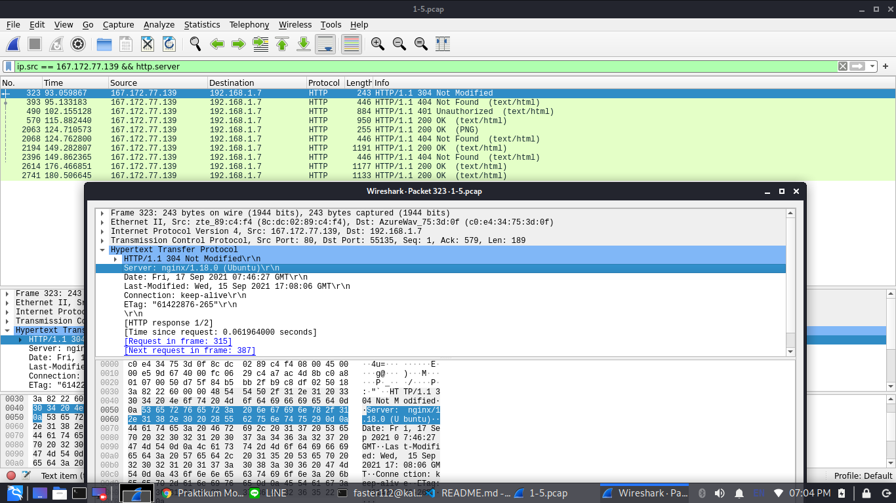
## Soal 2
Temukan paket dari **web-web** yang menggunakan **basic authentication** method!
* #### Filter
`http.authbasic`
* #### Penjelasan
`http.authbasic` digunakan untuk menemukan paket-paket web yang menggunakan method "basic authentication"
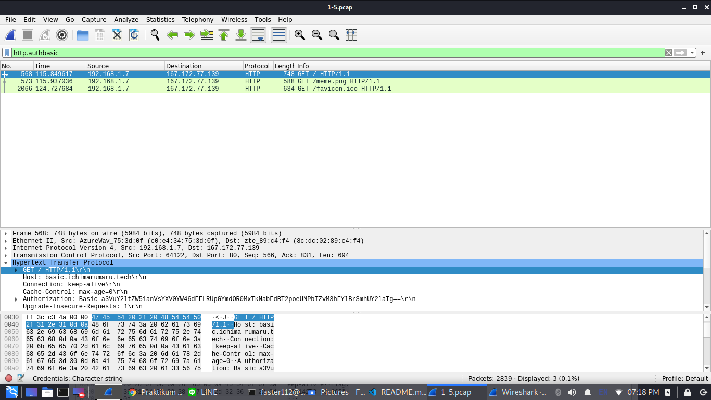
## Soal 3
Ikuti perintah di [basic.ichimarumaru.tech](basic.ichimarumaru.tech)! Username dan password bisa didapatkan dari file *.pcapng*!
* #### Filter
`http contains "basic"`
* #### Penjelasan
`http contains "basic"` digunakan untuk menemukan paket-paket dari subdomain "basic.ichimarumaru.tech". 
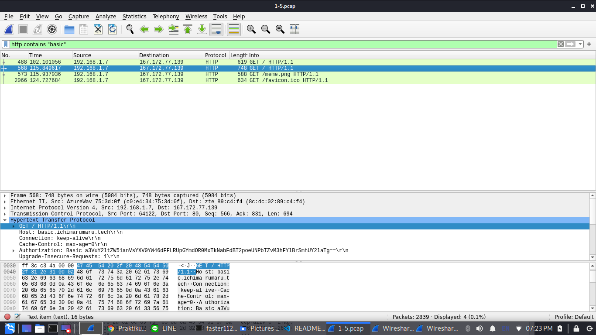
Lalu pada bagian `Authorization` bisa kita temukan kredensialnya yaitu `kuncimenujulautan:tQKEJFbgNGC1NCZlWAOjhyCOm6o3xEbPkJhTciZN`.
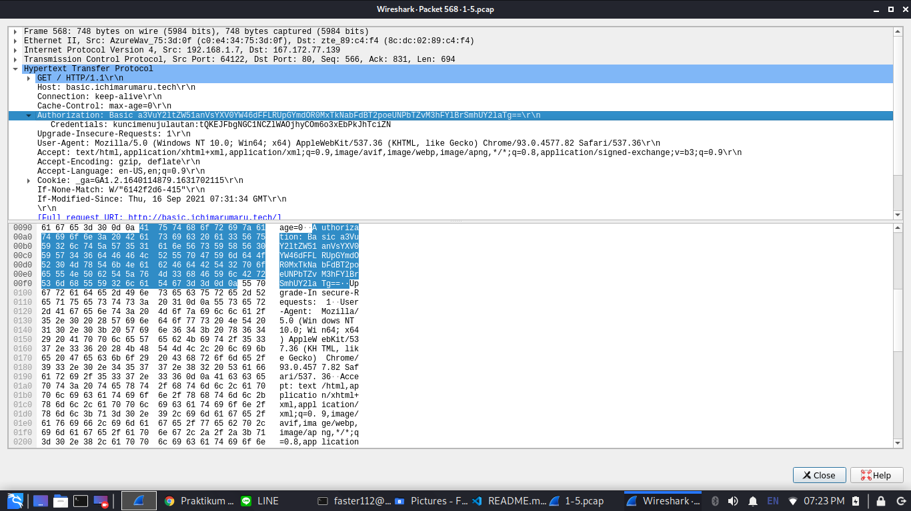
Setelah memasukkan kredensial tersebut pada website, isi pertanyaan yang disediakan.
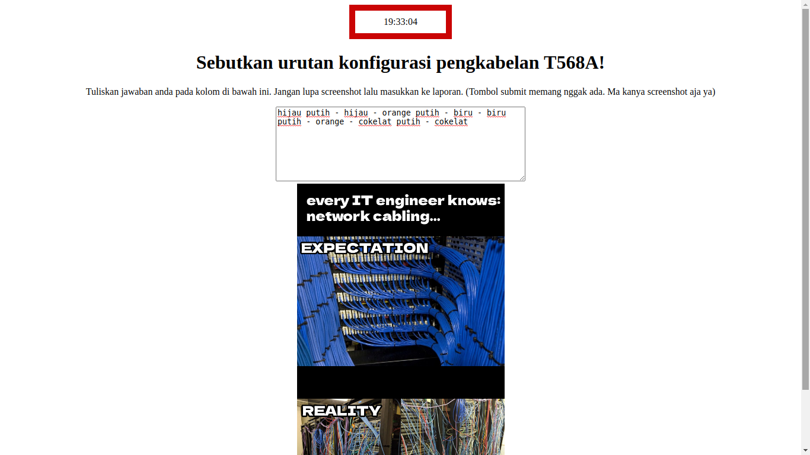
## Soal 4
Temukan paket **mysql** yang mengandung **perintah query select**!
* #### Filter
`mysql contains "select" || mysql contains "SELECT"`
* #### Penjelasan
`mysql contains "select"` digunakan untuk mendapatkan query "select". Karena "contains" merupakan *case sensitive* maka ditambah lagi dengan `mysql contains "SELECT"` untuk mendapatkan query "SELECT".
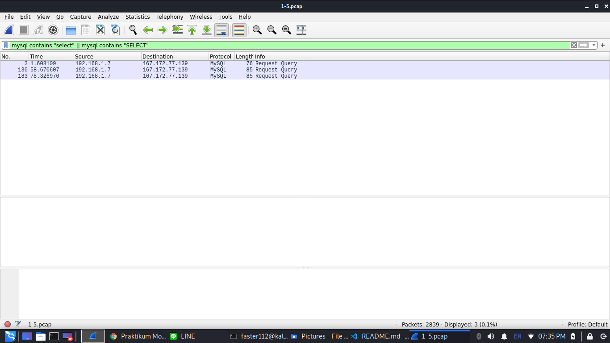
## Soal 5
Login ke [portal.ichimarumaru.tech](portal.ichimarumaru.tech) kemudian ikuti perintahnya! Username dan password bisa didapat dari **query insert** pada table **users** dari file .pcap!
* #### Filter
`mysql contains "INSERT" || mysql contains "insert"`
* #### Penjelasan
Sama seperti soal nomor 4, contains merupakan *case sensitive* jadi digunakanlah `mysql contains "INSERT" || mysql contains "insert"` untuk mendapatkan query "INSERT" dan "insert".
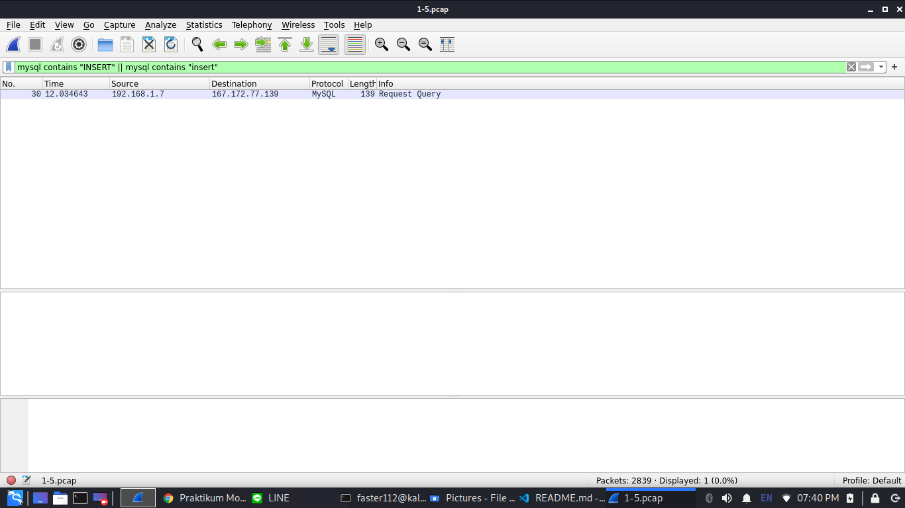
Karena hanya menemukan 1 paket dan setelah dibuka, didapatkanlah kredensial `akakanomi:pemisah4lautan`.
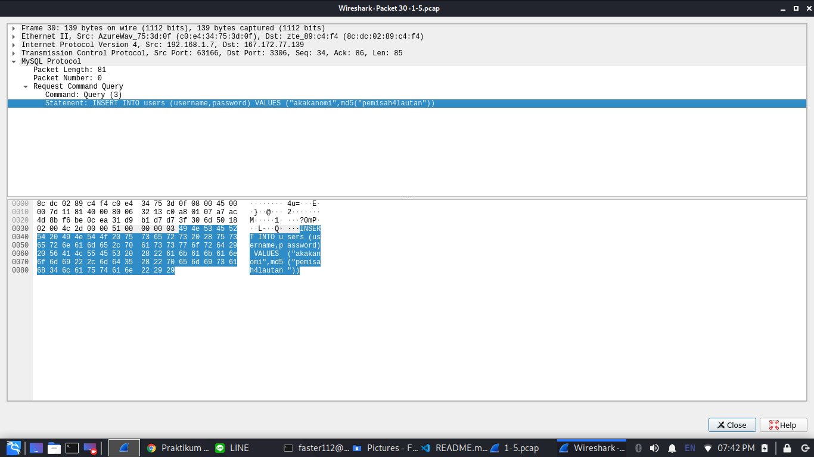
Setelah mendapatkan kredensial yang dibutuhkan dan masuk ke websitenya, isi pertanyaannya.
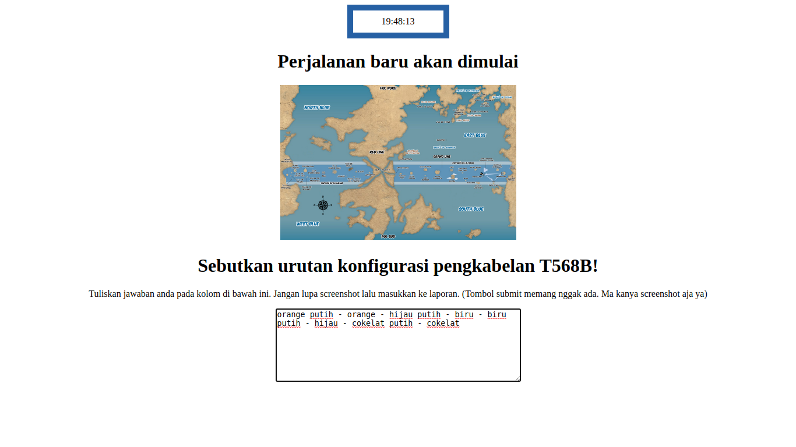
## Soal 6
Cari username dan password ketika melakukan login ke FTP Server!
* #### Filter
`ftp contains "USER" || ftp contains "PASS"`
* #### Penjelasan
`ftp contains "USER"` digunakan untuk mendapatkan username sementara `ftp contains "PASS"` digunakan untuk mendapatkan password.
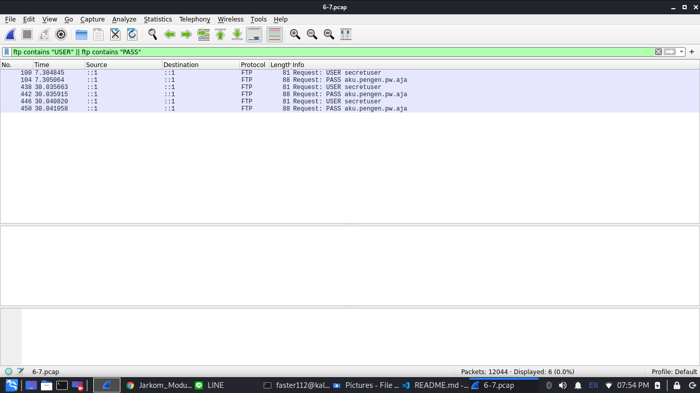
## Soal 7
Ada 500 file zip yang disimpan ke FTP Server dengan nama 0.zip, 1.zip, 2.zip, ..., 499.zip. Simpan dan Buka file pdf tersebut. (Hint = nama pdf-nya "Real.pdf")
* #### Filter
`ftp-data`
* #### Penjelasan
Pada soal ini, diperlukan filter sebanyak dua kali, yang pertama adalah **display filter** dengan menggunakan `ftp-data` kemudian **find packet** dengan menggunakan nilai hex dari string "Real.pdf" yaitu `5265616c2e706466` lalu ditemukan "201.zip".

Setelah itu Klik kanan > Follow > TCP Stream kemudian save as raw dan beri nama "Real.pdf".
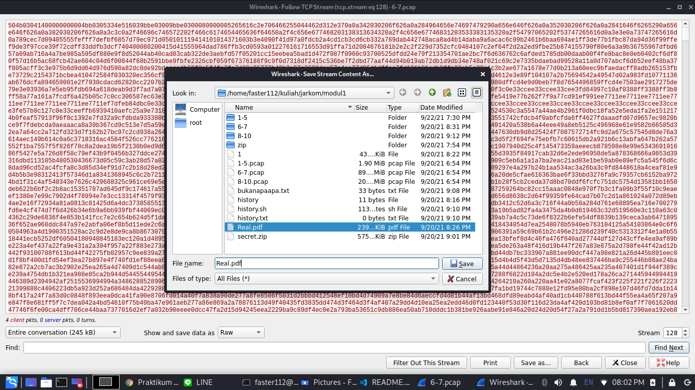
Kemudian buka PDF tersebut.

## Soal 8
Cari paket yang menunjukan pengunggahan file dari FTP tersebut!
* #### Filter
`ftp contains "STOR"`
* #### Penjelasan
`ftp contains "STOR` digunakan untuk mengambil nilai dari ftp yang mengandung "STOR" yang berfungsi sebagai penanda bahwa ada pengunggan file ke server.
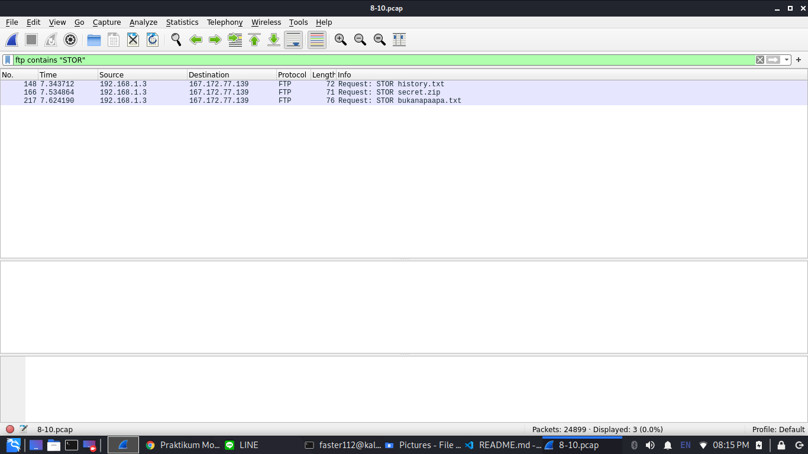
## Soal 9
Dari paket-paket yang menuju FTP terdapat indikasi penyimpanan beberapa file. Salah satunya adalah sebuah file berisi data rahasia dengan nama "secret.zip". Simpan dan buka file tersebut!
* #### Filter
`ftp-data`
* #### Penjelasan
`ftp-data` digunakan untuk menemukan semua hasil dari ftp.
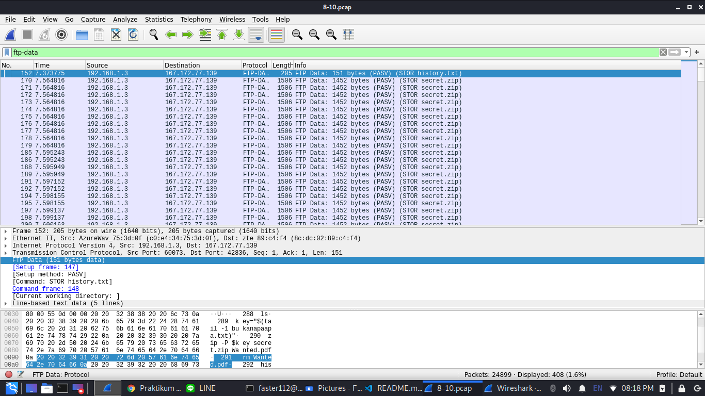
Kemudian pilih salah satu paket yang bernama "secret.zip" kemudian Klik kanan > Follow > TCP Stream kemudian save as raw dan beri nama "secret.zip".
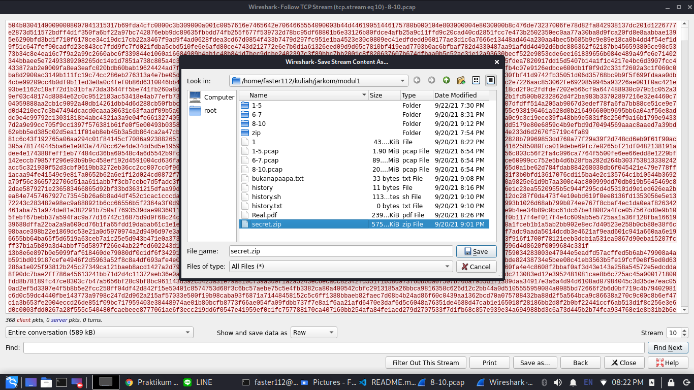
## Soal 10
Selain itu terdapat "history.txt" yang kemungkinan berisi history bash server tersebut! Gunakan isi dari "history.txt" untuk menemukan password untuk membuka file rahasia yang ada di "secret.zip"!
* #### Filter
`ftp-data contains "history"`
`ftp-data contains "bukanapaapa"`
* #### Penjelasan
`ftp-data contains "history"` digunakan untuk menemukan file "history.txt".
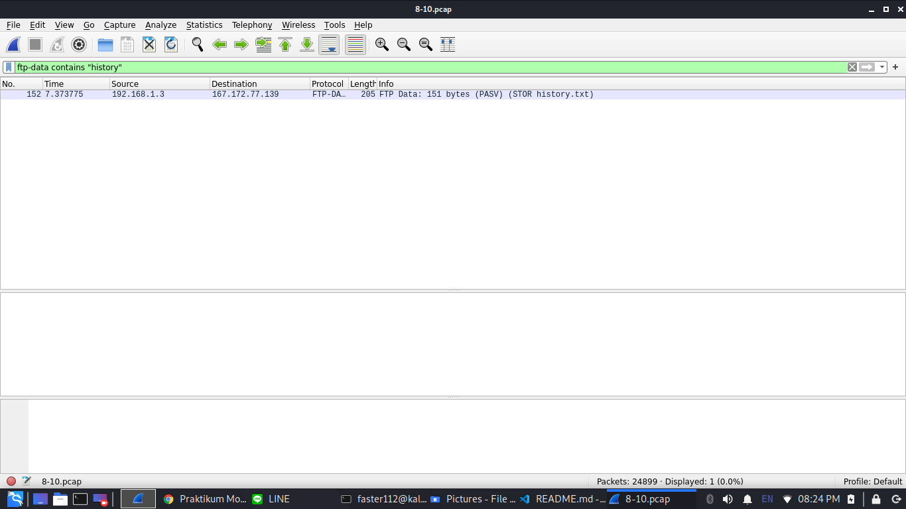
Kemudian Klik kanan > Follow > TCP Stream paket tersebut dan dapat diketahui bahwa password dari "secret.zip" ada di "bukanapaapa.txt".
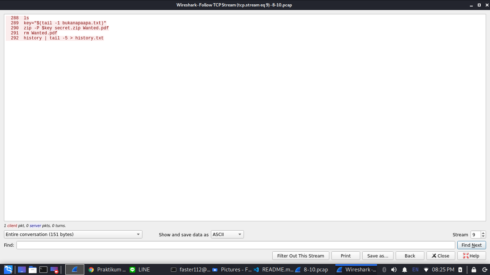
`ftp-data contains "bukanapaapa"` digunakan untuk mencari file "bukanapaapa.txt".
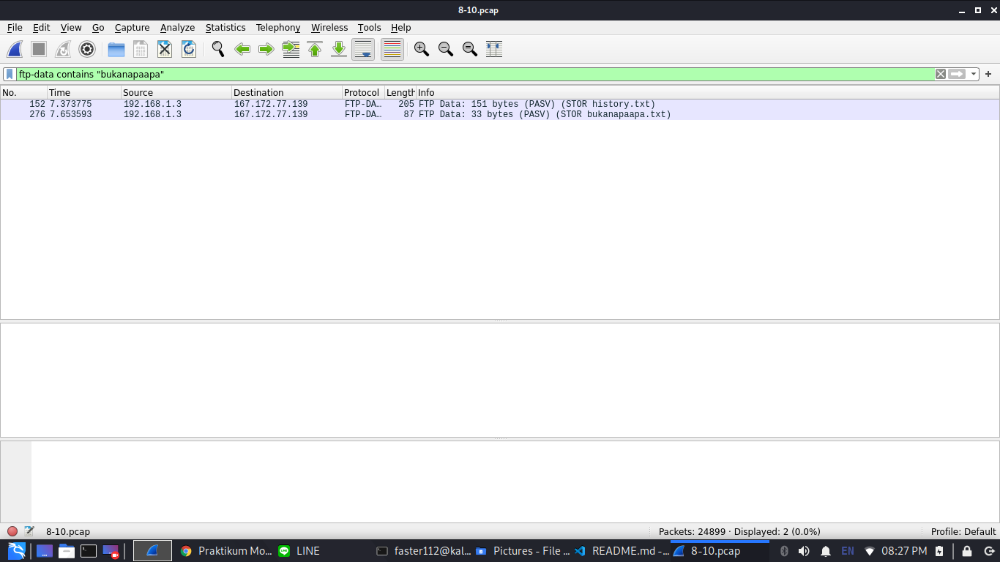
Kemudian Klik kanan > Follow > TCP Stream paket tersebut dan dapat diketahui bahwa password dari "secret.zip" adalah "d1b1langbukanapaapajugagapercaya".
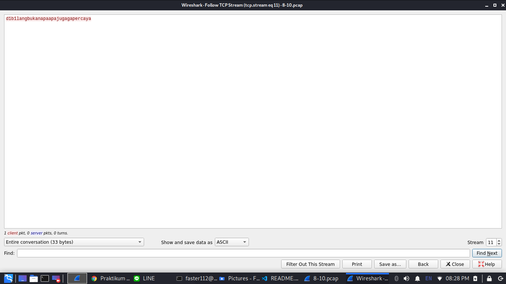
Kemudian buka "secret.zip" dan buka Wanted.pdf dan selesai.

## Soal 11
Filter sehingga wireshark hanya mengambil paket yang berasal dari port 80! 
* #### Filter
`tcp.srcport == 80 || udp.srcport == 80`
* #### Penjelasan
`tcp.srcport == 80` digunakan untuk mendapatkan paket dari port 80 (HTTP) dengan menggunakan protokol TCP, sedangkan `udp.srcport == 80` digunakan untuk mendapatkan paket dari port 80 (HTTP) dengan menggunakan protokol UDP.
## Soal 12
Filter sehingga wireshark hanya mengambil paket yang mengandung port 21!
* #### Filter
`tcp.port == 21 || udp.port == 21`
* #### Penjelasan
`tcp.port == 21` digunakan untuk mengambil paket yang mengandung port 21 (TCP/UDP) menggunakan protokol TCP, sedangkan `udp.port == 21` digunakan untuk mengambil paket yang mengambil paket yang mengandung port 21 (TCP/UDP) menggunakan protokol UDP.
## Soal 13
Filter sehingga wireshark hanya menampilkan paket yang menuju port 443!
* #### Filter
`tcp.dstport == 443 || udp.dstport == 443`
* #### Penjelasan
`tcp.dstport == 443` digunakan untuk mengambil paket yang menuju port 443 (HTTPS) menggunakan port TCP, sedangkan `udp.dstport == 443` digunakan untuk mengambil paket yang menuju port 443 (HTTPS) menggunakan port UDP.
## Soal 14
Filter sehingga wireshark hanya mengambil paket yang tujuannya ke kemenag.go.id!
* #### Filter
`ip.dst == 103.7.13.247`
* #### Penjelasan
`ip.dst == 103.7.13.247` digunakan untuk mendapatkan paket dari `ip 103.7.13.247` (IP dari website kemenag.go.id).
## Soal 15
Filter sehingga wireshark hanya mengambil paket yang berasal dari ip kalian!
* #### Filter
`ip.src == 192.168.250.242`
* #### Penjelasan
`ip.src == 192.168.250.242` digunakan untuk mengambil paket dari `ip 192.168.250.242` (IP dari komputer).